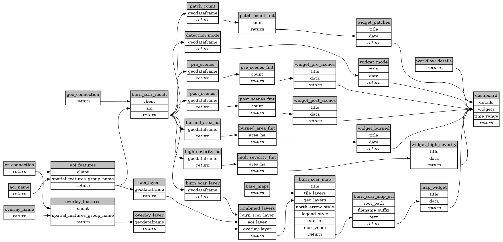

```
# AUTOGENERATED BY ECOSCOPE-WORKFLOWS; see fingerprint in README.md for details

```

```yaml
# fingerprint:
artifacts_sha256_basic: 9deb090b41328bd5ece00e2dff14e6dfdb762c1e85f4f05891ad0e4be7493281
artifacts_sha256_strict: 5893b9803e50a8149c15a1adef5b4c5d64d75051f4d97d71f7e7681f6ece7b84
installed_requirements:
- channel: https://repo.prefix.dev/ecoscope-workflows/
  name: ecoscope-platform
  version: {version: ==2.15.1}
- channel: conda-forge
  name: pydeck
  version: {version: ==0.9.2}
params_sha256: 61721734dd8efcd6b434a3c3cb9a3d7e9afa155eefa01cdace0b5fc793c911ad
spec_sha256: 90c2a03198efab43efdfc5e91612a3ec1910c59ea34a6102f55bf7cfec4056d6

```

# ecoscope-workflows-burn-scar-mapping-workflow


