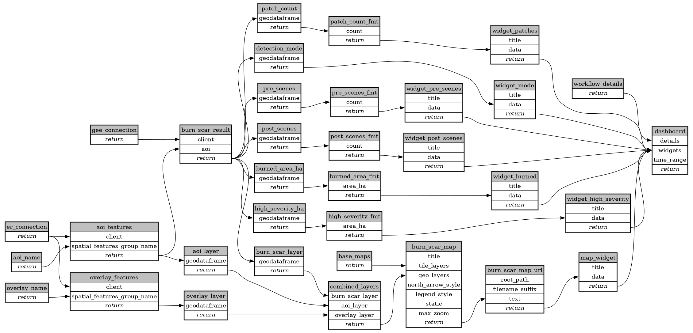

```
# AUTOGENERATED BY ECOSCOPE-WORKFLOWS; see fingerprint in README.md for details

```

```yaml
# fingerprint:
artifacts_sha256_basic: 1a5985ac916d8af56e13dccde68c56405a9a6545bf98acf34480507c8bc911b8
artifacts_sha256_strict: 3f725baa42820b7ea9cc01d185319142b993afe2a7807e3ce5f791dec2d5b6fd
installed_requirements:
- channel: https://repo.prefix.dev/ecoscope-workflows/
  name: ecoscope-platform
  version: {version: ==2.15.1}
- channel: conda-forge
  name: pydeck
  version: {version: ==0.9.2}
params_sha256: 61721734dd8efcd6b434a3c3cb9a3d7e9afa155eefa01cdace0b5fc793c911ad
spec_sha256: a598121edc8cd8e1e5d79eebf874128c56620f7675e3d26258d7d7bd4e190896

```

# ecoscope-workflows-cfw-burn-scar-mapping-workflow


